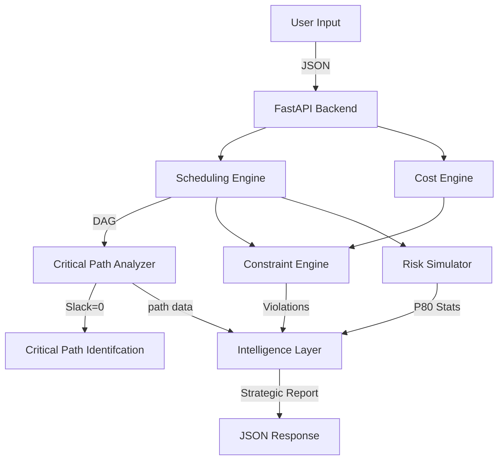

# Constructive Builder 🏗️

### Autonomous Constraint-Aware Construction Optimization Engine

  

---

## 🚀 Overview

**Constructive Builder** is an intelligent construction project management system designed to optimize scheduling, cost estimation, and risk assessment. Unlike traditional tools that merely record data, Constructive Builder actively _analyzes_ project feasibility using a multi-layered algorithmic approach.

It integrates:

- **Deterministic Logic**: Critical Path Method (CPM) & Topological Sort.
- **Probabilistic Simulation**: Monte Carlo Simulation for risk assessment (P50/P80).
- **Generative AI**: Google Gemini 2.0 Flash for strategic executive summaries.

---

## ⚡ Quick Start

### Prerequisites

- Python 3.10+
- Node.js 18+
- Google Gemini API Key (Optional but recommended for Full AI features)

### 1. Backend Setup

```bash
cd backend
# Install Python dependencies
pip install -r requirements.txt
# Run the FastAPI server
python app.py
```

_Listens on [http://localhost:8000](http://localhost:8000)_

### 2. Frontend Setup

```bash
cd frontend
# Install Node dependencies
npm install
# Run the Next.js development server
npm run dev
```

_Accessible at [http://localhost:3000](http://localhost:3000)_

---

## 🎮 How to Demo

1.  **Open Dashboard**: Navigate to `http://localhost:3000`.
2.  **Input Project Data**:
    - **Area**: e.g., `1000` (sq yards)
    - **Floors**: e.g., `2`
    - **Budget**: e.g., `5,000,000`
    - **Deadline**: e.g., `180` (days)
    - **Workforce Cap**: e.g., `50`
    - **API Key**: Enter your Gemini API key (or leave blank to trigger Simulation Mode if configured).
3.  **Run Analysis**: Click **Run Analysis**.
4.  **Explore Results**:
    - **Feasibility**: Check the "Feasible/Infeasible" badge.
    - **Constraint Violations**: See exact days where workforce > cap.
    - **Risk Profile**: Compare Deterministic Duration vs. P80 Risk-Adjusted Duration.
    - **Strategic Report**: Read the AI-generated executive summary.

---

## 📄 Project Design Report (PDR)

### 1. System Architecture

The application follows a modern decoupled Client-Server architecture.

- **Frontend**: Next.js 14 (React), Tailwind CSS, Lucide Icons.
- **Backend**: Python 3.12, FastAPI, Uvicorn.
- **Intelligence**: Google Gemini 2.0 Flash (via API) + Deterministic Fallback Engine.
- **Core Libraries**: `networkx` (Graph Theory), `numpy` (Simulation), `pydantic` (Data Validation).

#### 1.1 Functional Blocks



### 2. Core Modules & Algorithms

#### 2.1 Scheduling Engine (`scheduler.py`)

- **Logic**: Uses Directed Acyclic Graphs (DAG) to model task dependencies.
- **Algorithm**: Topological Sort to determine execution order; Forward Pass to calculate Earliest Start (ES) and Earliest Finish (EF).
- **Feature**: Dynamic duration calculation based on project area (`base_duration_per_sqyard * Area`).

#### 2.2 Critical Path Method (CPM) (`critical_path.py`)

- **Logic**: Performs a Backward Pass to calculate Latest Start (LS) and Latest Finish (LF).
- **Algorithm**: `Slack = LS - ES`. Tasks with `Slack == 0` are identified as Critical Path tasks.
- **Impact**: Delays in these tasks directly impact the project delivery date.

#### 2.3 Cost Engine (`cost_engine.py`)

- **Labor Cost**: `Duration × Required Workers × Daily Rate`.
- **Material Cost**: `Area × Floors × Material Coefficient`.
- **Overhead**: Fixed 10% markup on direct costs.
- **Granularity**: Costs are calculated per-task and aggregated.

#### 2.4 Constraint Engine (`constraints.py`)

- **Feasibility Checks**:
  1.  **Deadline**: Is `Total Duration <= Deadline`?
  2.  **Budget**: Is `Total Cost <= Budget`?
  3.  **Workforce**: Checks _daily_ resource loading. If `sum(workers)` on day `t` > `Cap`, it flags a violation.
- **Output**: Returns specific violations (e.g., "Day 45: Demand 60 > Cap 50").

#### 2.5 Risk Simulator (`simulation.py`)

- **Method**: Monte Carlo Simulation (500 iterations).
- **Variables**: Randomizes individual task durations by ±15% (Uniform Distribution).
- **Output**:
  - **P50**: Median expected duration.
  - **P80**: 80th percentile duration (conservative estimate).
  - **Risk Probability**: % of runs that exceed the user-defined deadline.

#### 2.6 Intelligence Layer (`gemini_service.py`)

- **Primary**: Gemini 2.0 Flash-Lite generates a "Strategic Executive Summary".
- **Fallback**: A robust, rule-based simulation engine that mimics the LLM's structure if the API is rate-limited (429 Error).
- **Output**: 5-Section Report (Feasibility, Violations, Optimization, Risks, Summary).

### 3. API Specification

#### POST `/analyze_project`

**Request Body:**

```json
{
  "area": 1000,
  "floors": 2,
  "deadline": 180,
  "budget": 5000000,
  "workforce_cap": 50,
  "provider": "gemini",
  "api_key": "sk-..."
}
```

**Response:**

```json
{
  "total_duration": 145,
  "feasibility_status": "Feasible",
  "total_cost": { ... },
  "critical_path_tasks": ["Excavation", "Foundation"],
  "simulation_results": { "p80_duration": 152 },
  "executive_summary": "Markdown string..."
}
```

---

_Created for SmartInternz Hackathon 2026_
