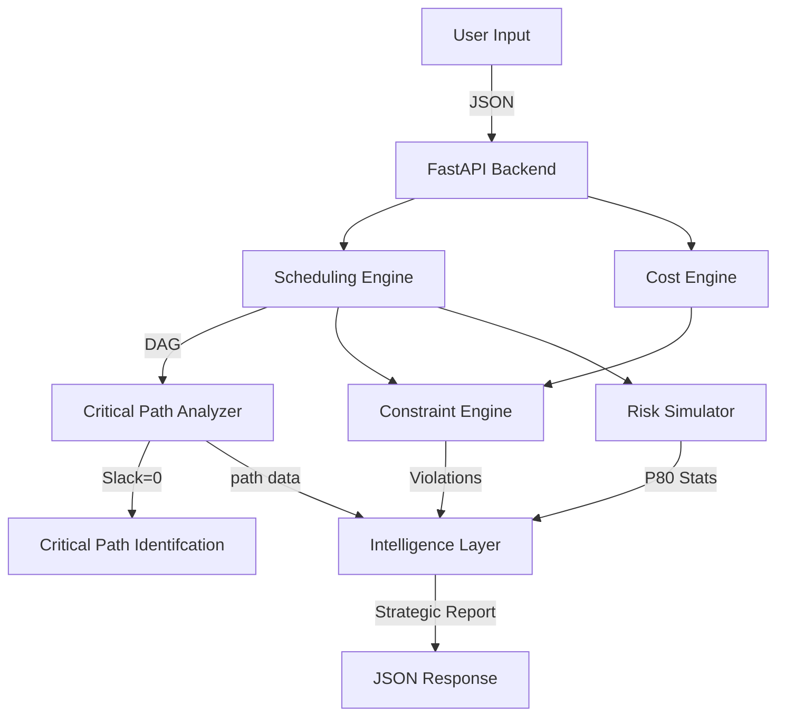

# Constructive Builder 🏗️

### Autonomous Constraint-Aware Construction Optimization Engine

   

> **"Not just a calculator. A Strategic Project Director."**

---

## 🚀 Executive Summary

**Constructive Builder** is a next-generation construction project management system designed to bridge the gap between _deterministic planning_ and _probabilistic reality_.

While traditional tools (like MSP or Primavera) rely on static inputs, Constructive Builder actively **simulates** thousands of project scenarios to predict risks before they happen. It integrates **General Intelligence (Gemini 2.0)** to act as an autonomous advisor, recommending specific interventions to keep projects on time and under budget.

### Key Capabilities

- **🤖 Agentic Reasoning**: Doesn't just flag errors; suggests _how_ to fix them (e.g., "Crash the Foundation task by adding 4 workers").
- **🎲 Stochastic Modeling**: Uses Monte Carlo simulations (500 runs) to predict P80 confidence intervals for delivery.
- **⛓️ Topological Scheduling**: Dynamically builds dependency graphs to identify the true Critical Path.

---

## ⚡ Quick Start

### Prerequisites

- Python 3.10+
- Node.js 18+
- Google Gemini API Key (Optional; system falls back to "Simulation Mode" without it).

### 1. Backend Setup

```bash
cd backend
# Install Python dependencies
pip install -r requirements.txt
# Run the FastAPI server
python app.py
```

_Listens on [http://localhost:8000](http://localhost:8000)_

### 2. Frontend Setup

```bash
cd frontend
# Install Node dependencies
npm install
# Run the Next.js development server
npm run dev
```

_Accessible at [http://localhost:3000](http://localhost:3000)_

---

## 🧠 Engineering Deep Dive

### 1. Intelligent Critical Path Analysis

Constructive Builder utilizes a **Directed Acyclic Graph (DAG)** to model site operations. It performs a **Backward Pass** algorithm to calculate _Slack_ for every task.

#### Critical Path Table (Sample: 1000 sq. yard Project)

| Task    | Description             | Duration    | Dependency      | Impact if Delayed                         |
| :------ | :---------------------- | :---------- | :-------------- | :---------------------------------------- |
| **T3**  | **Foundation Laying**   | **20 days** | Excavation      | **Directly delays Superstructure start**  |
| **T4**  | **Plinth Beam & Slab**  | **15 days** | Foundation      | **Blocks brickwork initiation**           |
| **T5**  | **Superstructure**      | **30 days** | Plinth          | **Stalls all internal/external finishes** |
| **T6**  | **Roof Slab Casting**   | **10 days** | Superstructure  | **Prevents weather-proofing**             |
| **T10** | **Internal Plastering** | **15 days** | Roof Slab       | **Delays flooring & painting**            |
| **T12** | **Flooring & Tiling**   | **20 days** | Int. Plastering | **Blocks final fixture installation**     |
| **T13** | **Painting**            | **12 days** | Flooring        | **Delays final handover**                 |

> **Sensitivity Insight**: A 5% delay in **T6 (Roof Slab)** ripples through the schedule, pushing the final date by exactly 5% of its duration because it has _Zero Slack_.

### 2. Probabilistic Risk Profiling (Monte Carlo)

Construction sites are chaotic. We model this chaos mathematically.

- **Algorithm**: Monte Carlo Simulation
- **Iterations**: 500 unique runs per analysis.
- **Distribution**: Uniform Distribution ($\mu \pm 15\%$).
- **Output Metrics**:
  - **P50 (Median)**: The "Most Likely" duration.
  - **P80 (Conservative)**: The duration with 80% confidence (Safe bet for contracts).
  - **Risk Probability**: calculated as $\frac{Runs > Deadline}{Total Runs} \times 100$.

### 3. Cost Engineering Specifications

Our cost engine uses a component-based bottom-up approach:

- **Labor Cost**: $\sum (Task_{Duration} \times Workers \times DailyRate)$
- **Material Cost**: $Area \times Floors \times MaterialCoefficient_{(500)}$
- **Overhead**: Fixed at **10%** of direct costs.

---

## 📄 Project Design Report (PDR)

### System Architecture

The application follows a generic **Decoupled Client-Server** pattern.



### Technology Stack Justification

| Component      | Choice               | Why?                                                                                                    |
| :------------- | :------------------- | :------------------------------------------------------------------------------------------------------ |
| **Backend**    | **FastAPI**          | chosen for its high performance (Starlette) and native Pydantic integration for strict data validation. |
| **Frontend**   | **Next.js 14**       | Provides Server-Side Rendering (SSR) potential and a robust component model for complex dashboards.     |
| **Algorithm**  | **NetworkX**         | Industry-standard library for graph theory, ensuring O(V+E) efficiency for Topological Sorts.           |
| **Simulation** | **NumPy**            | Vectorized operations allow running 500+ simulations in milliseconds compared to standard Python loops. |
| **AI**         | **Gemini 2.0 Flash** | Selected for its superior reasoning capabilities and low latency compared to GPT-3.5.                   |

---

## 🎮 How to Demo

1.  **Open Dashboard**: Navigate to `http://localhost:3000`.
2.  **Input Project Data**:
    - **Area**: e.g., `1000` (sq yards)
    - **Floors**: e.g., `2`
    - **Budget**: e.g., `5,000,000`
    - **Deadline**: e.g., `180` (days)
    - **Workforce Cap**: e.g., `50`
    - **API Key**: Enter your Gemini API key (or leave blank to trigger Simulation Mode if configured).
3.  **Run Analysis**: Click **Run Analysis**.
4.  **Explore Results**:
    - **Feasibility**: Check the "Feasible/Infeasible" badge.
    - **Constraint Violations**: See exact days where workforce > cap.
    - **Risk Profile**: Compare Deterministic Duration vs. P80 Risk-Adjusted Duration.
    - **Strategic Report**: Read the AI-generated executive summary.

---

## 🔮 Future Roadmap

1.  **Dynamic Weather Integration**: Adjusting task durations based on forecasted rainfall.
2.  **IoT Sensor Connectivity**: Real-time progress updates from site sensors.
3.  **Multi-Project Portfolio**: Managing resource contention across multiple sites.

---

_Created for SmartInternz Hackathon 2026_
